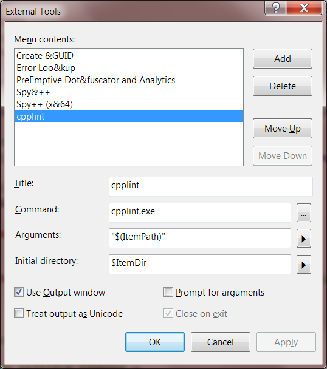
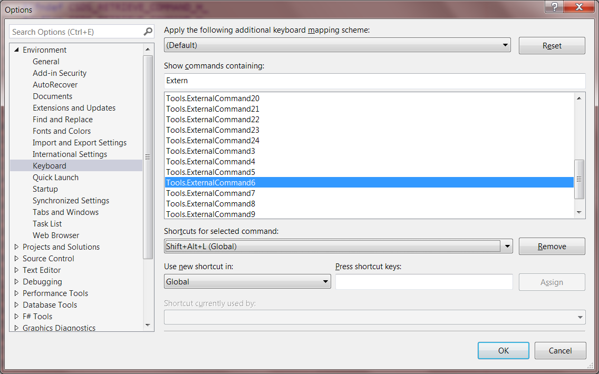

# Install Cpplint And Integrate Into Visual Studio
@(C++)

## Install Cpplint

Cpplint is a Python script developed by Google. The full script name is `cpplint.py`.
You can download it from [GitHub](https://github.com/google/styleguide/tree/gh-pages/cpplint), or install directly from `pip`.

If you choose to install from `pip`, you will get an executable file named `cpplint.exe` which is simply a “wrapper” for `cpplint.py`. You can run this executable file just as you run the python script.

Check if you have Python installed:
```bash
$ python -V
Python 3.6.4
```
My Python installed is 3.6.4, 32-bit. Python 2.7.x should be OK, too.

Install `cpplint` with `pip`:
```bash
$ pip install cpplint
```
Try it:
```bash
$ cpplint --help

Syntax: cpplint.py [--verbose=#] [--output=emacs|eclipse|vs7|junit]
                   [--filter=-x,+y,...]
                   [--counting=total|toplevel|detailed] [--repository=path]
                   [--root=subdir] [--linelength=digits] [--recursive]
                   [--exclude=path]
                   [--headers=ext1,ext2]
                   [--extensions=hpp,cpp,...]
        <file> [file] ...

  The style guidelines this tries to follow are those in
    https://google.github.io/styleguide/cppguide.html
...
```

The executable file `cpplint.exe` is located in `<PythonInstallDir>\Scripts\cpplint.exe`. And `<PythonInstallDir>\Scripts` should have already been in your `PATH`, if not, add it please.

Please also note that the cpplint installed from pip is actually [a fork](https://github.com/TheOstrichIO/cpplint) of the official one.

## Integrate Into Visual Studio

As I know, Visual Studio doesn't have a native plugin for cpplint. Editors like Vim or VS Code do have such plugins. These deep integrated plugins allow the editors to display/highlight the reported issues just inside the text area or gutter. But that's another story.

### Add An External Tool

*External Tools* provides a very basic integration to external commands. We will integrate `cpplint` by *External Tools*.

Open the *External Tools* dialog by menu **TOOLS / External Tools...**.



Click **Add** button to add an external tool according to the above screenshot.
Note that the **Command** must be `cpplint.exe`, simply typing `cpplint` will not work.

Check **Use Output window** for displaying lint results in the Output Window.

In this dialog, please count the number of your new cpplint tool. For me, it's `6` (NOT zero based).
Save the changes.

### Bind A Shortcut Key

It would be much convenient if the new external tool can be invoked by pressing a shortcut key.

Open the *Options* dialog by menu **Tools / Options ...**, select **Environment / Keyboard** page, type "External" in **Show commands containing** text edit control, find **Tools.ExternalCommand6** in the list (NOTE: the number depends).



 Assign a shortcut to this command, e.g., `Shift+Alt+L`.
 In **Use new shortcut in** combo box, you can also select **Text Editor** instead of **Global** to limit the scope of the shortcut.

### Run The External Tool

Open any C++ file, click the menu **Tools / cpplint** or press the shortcut key just configured, you can see lint results in the Output Window.

## Customize Cpplint

### Bug: `--root` Doesn't Work On Windows

The official cpplint (as well as the pip version) has a bug about parameter `--root`. This will cause wrong warnings about header guards. See the issue here: https://github.com/google/styleguide/issues/22.

It's very strange that Google doesn't resolve it. So I just modified it by myself. Copy my hacked cpplint.py (in the same directory as this article) to `<PythonInstallDir>\Lib\site-packages` and overwrite the one installed by `pip`.

### Output Format

By default, the output is formatted to ease Emacs parsing. You can specify `--output=vs7` instead. But there's no big difference.

NOTE: `--output` cannot be configured in`CPPLINT.cfg` file.

### CPPLINT.cfg

Cpplint supports per-directory configurations specified in `CPPLINT.cfg` files. `CPPLINT.cfg` file can contain a number of `key=value` pairs.

Normally, your project should have one or more `CPPLINT.cfg` files which are tracked by Git, so that your team can share the same style configurations.

For example, I have added a `CPPLINT.cfg` file to my project directory `<CSI>\2DViewer`:
```plain
set noparent
filter=+build,+readability,+runtime,+whitespace,-whitespace/indent,-legal/copyright
root=2DViewer/src
linelength=100
```
The configuration should be adjusted accordingly.
